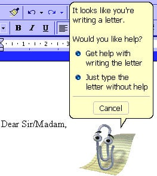

# Astro Starter Kit: Minimal

## Infos

Le fichier `.env` doit contenir:

```ini
ASTRO_HUGGING_CHAT_TOKEN=token # Si on ne veut pas d'oauth
ASTRO_HUGGING_FACE_CLIENT_ID=clientid # Pour l'oauth
```

## Introduction

J'ai commencé par créer un projet Astro minimal.

Je vais utiliser ces outils dans mon stack, la majorité de ces outils sont inconnus à mes yeux (à part Typescript):

- Astro
  - Nouveau Framework web qui supporte le SSR, SSG et CSR
  - Successeur spirituel de Gatsby
- SQLite géré par Astro DB
- Typescript (forcément)
- ~~Netlify~~ Vercel
  - Je voulais déployer mon site sur internet avec Netlify mais son architecture n'est pas adaptée à mes besoins de SSR.
  - Vercel est un peu mieux et a une meilleur gestion du SSR.
- Hugging Face (abregé en HF)
  - Offre un API qui permet de connecter un utilisateur à mon application et bénéficier de l'API d'Inference LLM en tant qu'utilisateur, sans dépasser ma propre limite d'usage.
  - Aussi bénéficier d'une clé privée pour que mon api communique au LLM sans demander à l'utilisateur de se connecter.

L'idée initiale est de créer un site web perso de blog. Mais les consignes ont changées et on va utiliser un LLM pour générer des histoires.

Donc le site:

- Sera site web fourre-tout
- Contiendra une page avec le LLM
  - Un formulaire pour demander au LLM de générer l'histoire (Seulement si l'utilisateur est connecté avec HF)
  - Une liste des générations précédentes
  - Détails des générations précédentes en cliquant sur un élement de la liste
- Un petit assistant LLM pour les utilisateurs anonymes pour savoir si un truc est SISR ou SLAM
- Sera deployé vers ~~Netlify~~ Vercel à chaque commit avec Github Actions

Pour commencer, je crée mon projet Astro minimal.

```sh
npm create astro@latest -- --template minimal
```

### Les pages

J'ajoute un Layout dans `pages/layouts/MainLayout.astro` pour le style générale du site sur toutes les pages. Je crée également une page d'index principale et une page 404.

Enfin, j'ajoute le dossier contenant la page d'index pour mon générateur d'histoire `pages/scp/index.astro` ainsi que les pages de détails de l'histoire `pages/scp/[...id].astro`. Si l'utilisateur se rend à `/scp`, il trouvera la page d'index, si il va à `/scp/1`, il trouvera le premier SCP.

### Côté React

Le dossier `components` contient les composants côté client en `.tsx` et on peut utiliser l'API du navigateur. Il faut ajouter l'attribut `client:load` dans la balise HTML.

Les composants côté serveurs dans `components/server` sont rendus par le serveur et ne bénéficient pas de l'API du navigateur du client, il faut privilégier le rendu côté serveur pour garder les performances au client au maximum.

### API

Astro utilise des fichiers `.ts` pour gérer le back-end à un plus bas niveau et créer des API en json par exemple.

J'ajoute un API pour soumettre le formulaire dans `pages/api/submit-scp.ts`, Astro supporte les fichiers javascript pour faire des API qui retournent du json par exemple.

Et pour plus tard, un callback pour l'Oauth dans `pages/auth/callback.ts` mais j'ignore à quoi ça sert pour l'instant.

### Fonctionnalités

Pour le SISR vs SLAM, on va créer un composant React dans `components/SlamOrSisr.tsx` et on va l'ajouter à notre `MainLayout`

## ~~Netlify~~ Vercel

Je crée une branche de développement pour Vercel

# Restyle du site
Le site est fonctionnel, mais il est très moche alors j'ai créé une branche Restyle pour restyler le site. J'ai aussi travaillé sur l'agent LLM sur cette branche.

# Assistant LLM

Au départ je voulais faire un simple formulaire et quand on écrit un prompt et qu'on clique sur soumettre: interroger un LLM si le prompt est à propos du SLAM ou du SISR.

J'ai donc programmé quelque chose de rudimentaire et pas très joli à regarder, mais ça fonctionne malgré la mauvaise UX.

Donc après l'avoir fait, je l'ai développé un peu plus, le transformant en un agent LLM un peu plus généraliste. Mais cette fois ci il y aura une bulle de texte animé avec des effets sonores et un effet "machine a écrir" qui s'affiche. L'intérêt est limité, mais reste joli et immersif, donnant un petit côté "Jeu vidéo". De plus, dans le futur, je souhaite convertir ça en un petit personnage qui parle similaire à Clippy.



Donc j'ai commencé par créé un composant React pour SlamOrSisr séparé en plusieurs petits composants, dans un seul fichier. J'ai commencé à mieux diviser les composants, le SpeechBubble a été mit dans son propre fichier mais le panneau et le bouton pour l'afficher ont été gardé dans SlamOrSisr.

Le plus gros soucis était de faire l'animation. C'est une animation CSS donc il suffit juste de changer la classe.
Mais il ne faut pas démonter immédiatement le composant "SpeechBubble", sinon l'animation ne se joue pas (logique car le composant n'est plus rendu dans le DOM).

L'effet de machine à écrire est artificielle, c'est à dire que le serveur envoie au client le texte intégralement généré, et le client simule une machine à écrire. Mais c'est pas l'approche qui se fait normalement